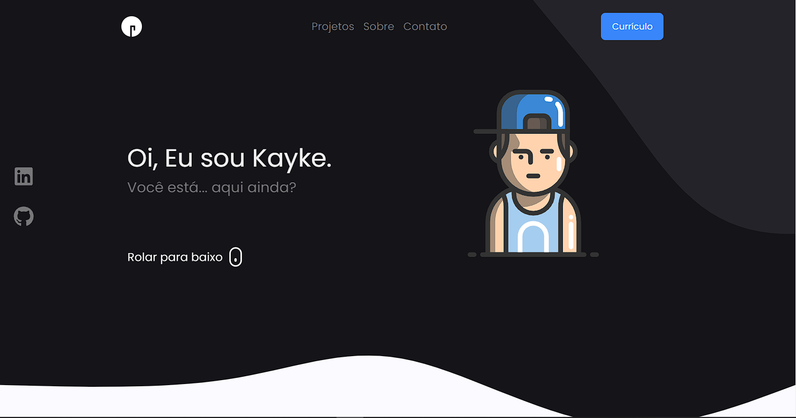

**Portfolio**
Visualização ao vivo - [Clique Aqui](https://kaykemigon.github.io/)

 

  

 
 

# 🛠 Instruções de instalação e configuração

1. Fork e clone esse repositorio. Você precisará de NodeJs e Git instalados em sua máquina.

2. Instalação: `npm install --legacy-peer-deps`

3. No diretório do projeto, você pode executar: `npm start`\
Executa o aplicativo no modo de desenvolvimento.
Abra [http://localhost:3000](http://localhost:3000) para visualizá-lo no navegador.

# Instruções de uso

1. Abra a pasta do projeto, navegue até ´/src/assets/data` e adicione os detalhes do seu projeto.

2. Você encontrará todos os componentes usados ​​e poderá editar suas informações de acordo.

# Implantar com páginas do Github

1. Dê um nome ao fork `<your-github-username>.github.io`
2. Edite a `homepage` propriedade no seu `package.json` arquivo

      `"homepage": "http://<your-github-username>.github.io/"`

3. Implantar o aplicativo

   `npm run deploy`

## Contribuir

Solicitações pull são bem-vindas :)

## Mostre seu apoio

Dê um ⭐ se você gostou deste website!
